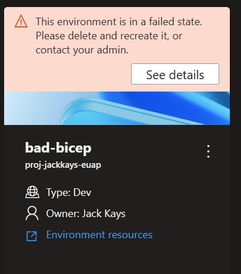
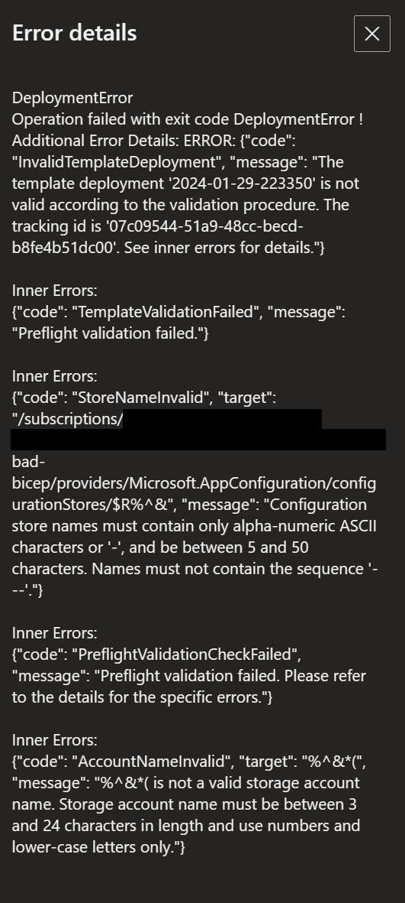

# ADE Custom Image Support - Creating A Docker Image to Provision Using ARM or Bicep
This page is designed to help customers understand how to build and utilize custom images within their environment definitions for deployments in Azure Deployment Environments. This document gives an overview on how to configure a custom image to provision infrastructure using the Bicep Infrastructure-as-Code (IaC) framework through Azure Deployment Environments. 

To see how the ADE-authored Core and ARM/Bicep images are structured, check out the Runner-Images folder [here](../../Runner-Images/README.md).

In order to use the ADE CLI, you will need to use an ADE-authored image as a base image. More information about the ADE CLI can be found [here](./ade-cli-docs/README.md).

## Creating and Building A Docker Image Using Terraform

### FROM Statement

If you are wanting to build a Docker image to utilize ADE deployments and access the ADE CLI, you will want to base your image off of one of the ADE-authored images. This can be done by including a FROM statement within a created DockerFile for your new image pointing to an ADE-authored image hosted on Microsoft Artifact Registry.

Here's an example of that FROM statement, pointing to the ADE-authored core image:
```docker
FROM mcr.microsoft.com/deployment-environments/runners/core:latest
```

This statement pulls the most recently-published core image, and makes it a basis for your custom image. Ideally, when building custom images, it's best practice to build off of the ADE-authored core image.

### Installing Bicep Within Your Dockerfile

Using the RUN statement, we can install the Bicep package with the Azure CLI:
```docker
RUN az bicep install
```

You can use the RUN statement to install any additional packages you would need to use within your image. ADE-authored images are based off of the Azure CLI image, and have the ADE CLI and JQ packages pre-installed. You can learn more about the Azure CLI [here](https://learn.microsoft.com/en-us/cli/azure/), and the JQ package [here](https://devdocs.io/jq/).


### Executing Operation Shell Scripts

Within the ADE-authored images, operations are determined and executed based off of the operation name. Currently, the two operation names supported are 'deploy' and 'delete', with plans to expand this moving forward.

To set up your custom image to utilize this structure, specify a folder at the level of your Dockerfile named 'scripts', and specify two files, 'deploy.sh', and 'delete.sh'. The 'deploy' shell script will run when your environment is created or redeployed, and the 'delete' shell script will run when your environment is deleted. You can see examples of this within this repository under the Runner-Images folder for the ARM-Bicep image.

To ensure these shell scripts are executable, add the following lines to your Dockerfile:
```docker
COPY scripts/* /scripts/
RUN find /scripts/ -type f -iname "*.sh" -exec dos2unix '{}' '+'
RUN find /scripts/ -type f -iname "*.sh" -exec chmod +x {} \;
```

### Authoring Operation Shell Scripts to Deploy ARM or Bicep Templates
To ensure we successfully deploy ARM or Bicep infrastructure through ADE, we need to take a few steps to ensure the deployment is successful:
- Convert ADE parameters to ARM-acceptable parameters
- Resolve linked templates if they are used in the deployment
- Use ADE's priveleged managed identity to perform the deployment

During the core image's entrypoint, any parameters set for the current environment will be stored under the variable `$ADE_OPERATION_PARAMETERS`. In order to convert them to ARM-acceptable parameters, you can run the following command using JQ:
```bash
# format the parameters as arm parameters
deploymentParameters=$(echo "$ADE_OPERATION_PARAMETERS" | jq --compact-output '{ "$schema": "https://schema.management.azure.com/schemas/2019-04-01/deploymentParameters.json#", "contentVersion": "1.0.0.0", "parameters": (to_entries | if length == 0 then {} else (map( { (.key): { "value": .value } } ) | add) end) }' )
```

Next, in order to resolve any linked templates used within an ARM JSON-based template, you can decompile the main template file, which will resolve all the local infrastructure files used into a number of Bicep modules, and then rebuild those modules back into a single ARM template with the linked templates embedded into the main ARM template as nested templates. This step is only necessary during the deployment operation. The main template file can be specified using the `$ADE_TEMPLATE_FILE` set during the core image's entrypoint, and it's recommended to reset this variable with the recompiled template file. This is done using the following commands:
```bash
if [[ $ADE_TEMPLATE_FILE == *.json ]]; then

    hasRelativePath=$( cat $ADE_TEMPLATE_FILE | jq '[.. | objects | select(has("templateLink") and (.templateLink | has("relativePath")))] | any' )

    if [ "$hasRelativePath" = "true" ]; then
        echo "Resolving linked ARM templates"

        bicepTemplate="${ADE_TEMPLATE_FILE/.json/.bicep}"
        generatedTemplate="${ADE_TEMPLATE_FILE/.json/.generated.json}"

        az bicep decompile --file "$ADE_TEMPLATE_FILE"
        az bicep build --file "$bicepTemplate" --outfile "$generatedTemplate"

        # Correctly reassign ADE_TEMPLATE_FILE without the $ prefix during assignment
        ADE_TEMPLATE_FILE="$generatedTemplate"
    fi
fi
```
Then, we'll want to ensure we sign in with ADE's privileged managed identity in order to have the appropriate permissions to execute the deployment and deletion of resources within the subscription. If your deployment needs special permissions to complete your deployment, such as particular roles, you will want to assign those permissions to the project environment type's identity that is being used for your environment deployment. Sometimes, the managed identity isn't immediately available when entering the container, so we'll want to do successive retries until login in successful. 
```bash
echo "Signing into Azure using MSI"
while true; do
    # managed identity isn't available immediately
    # we need to do retry after a short nap
    az login --identity --allow-no-subscriptions --only-show-errors --output none && {
        echo "Successfully signed into Azure"
        break
    } || sleep 5
done
```

Now that we've ensured we're ready to begin deployment of the ARM or Bicep templates, we can run the following command below. When running this inside the container, it's important to choose a deployment name that will not override any past deployments, and use the `--no-prompt true` and `--only-show-errors` flags to ensure the deployment will not fail on any warnings or stall on waiting for user input.

```bash
deploymentName=$(date +"%Y-%m-%d-%H%M%S")
az deployment group create --subscription $ADE_SUBSCRIPTION_ID \
    --resource-group "$ADE_RESOURCE_GROUP_NAME" \
    --name "$deploymentName" \
    --no-prompt true --no-wait \
    --template-file "$ADE_TEMPLATE_FILE" \
    --parameters "$deploymentParameters" \
    --only-show-errors
```

To delete an environment, we perform a Complete-mode deployment and provide an empty ARM template, which removes all resources within the specified ADE resource group, shown below:
```bash
deploymentName=$(date +"%Y-%m-%d-%H%M%S")
az deployment group create --resource-group "$ADE_RESOURCE_GROUP_NAME" \
    --name "$deploymentName" \
    --no-prompt true --no-wait --mode Complete \
    --only-show-errors \
    --template-file "$DIR/empty.json"
```

You can check the provisioning state and details by running the below commands. ADE uses some special functions to read and provide additional context based off of the provisioning details, which you can find in the 'Runner-Images' folder [here](../../Runner-Images/README.md), but a simple implementation could be as follows:
```bash
if [ $? -eq 0 ]; then # deployment successfully created
    while true; do

        sleep 1

        ProvisioningState=$(az deployment group show --resource-group "$ADE_RESOURCE_GROUP_NAME" --name "$deploymentName" --query "properties.provisioningState" -o tsv)
        ProvisioningDetails=$(az deployment operation group list --resource-group "$ADE_RESOURCE_GROUP_NAME" --name "$deploymentName")

        echo "$ProvisioningDetails"

        if [[ "CANCELED|FAILED|SUCCEEDED" == *"${ProvisioningState^^}"* ]]; then

            echo -e "\nDeployment $deploymentName: $ProvisioningState"

            if [[ "CANCELED|FAILED" == *"${ProvisioningState^^}"* ]]; then
                exit 11
            else
                break
            fi
        fi
    done
fi
```

Finally, to read the outputs of your deployment and pass them to ADE to make them accessible via the Azure CLI, you can run the following commands:
```bash
deploymentOutput=$(az deployment group show -g "$ADE_RESOURCE_GROUP_NAME" -n "$deploymentName" --query properties.outputs)
if [ -z "$deploymentOutput" ]; then
    deploymentOutput="{}"
fi
echo "{\"outputs\": $deploymentOutput}" > $ADE_OUTPUTS
```

### Building the Image

To build the image to be pushed to your registry, please ensure the Docker Engine is installed on your computer, navigate to the directory of your Dockerfile, and run the following command:
```docker
docker build . -t {YOUR_REGISTRY}.azurecr.io/{YOUR_REPOSITORY}:{YOUR_TAG}
```

For example, if you wanted to save your image under a repository within your registry named 'customImage', and you wanted to upload with the tag version of '1.0.0', you would run:

```docker
docker build . -t {YOUR_REGISTRY}.azurecr.io/customImage:1.0.0
```
## Pushing the Docker Image to a Registry
In order to use custom images, you will need to set up a publicly-accessible image registry with anonymous image pull enabled. This way, Azure Deployment Environments can access your custom image to execute in our container. We are working on providing capaiblities for private registry access, and will provide an update when this is available. 

Azure Container Registry is an offering by Azure that provides storing of container images and similar artifacts.

To create a registry, which can be done through the Azure CLI, the Azure Portal, Powershell commands, and more, please follow one of the quickstarts [here](https://learn.microsoft.com/en-us/azure/container-registry/container-registry-get-started-azure-cli).

To set up your registry to have anonymous image pull enabled, please run the following command in the Azure CLI:
```bash
az login
az acr login -n {YOUR_REGISTRY}
az acr update -n {YOUR_REGISTRY} --public-network-enabled true
az acr update -n {YOUR_REGISTRY} --anonymous-pull-enabled true
```
When you are ready to push your image to your registry, run the following command:
```docker
docker push {YOUR_REGISTRY}.azurecr.io/{YOUR_REPOSITORY}:{YOUR_TAG}
```

## Connecting the Image to your Environment Definition

When authoring environment definitions to use your custom image in their deployment, simply edit the 'runner' property on the manifest file (environment.yaml or manifest.yaml).
```yaml
runner: "{YOUR_REGISTRY}.azurecr.io/{YOUR_REPOSITORY}:{YOUR_TAG}"
```

## Image Building Quickstart Script
If you have a Dockerfile and scripts folder configured for ADE's extensibility model, you can run the script [here](../../Runner-Images/quickstart-image-build.ps1) to build and push to a specified Azure Container Registry (ACR) under the repository 'ade' and the tag 'latest'. This script requires your registry name and directory for your custom image, have the Azure CLI and Docker Desktop installed and in your PATH variables, and requires that you have permissions to push to the specified registry. You can call the script using the following command in Powershell:
```powershell
.\quickstart-image-build.ps1 -Registry '{YOUR_REGISTRY}' -Directory '{DIRECTORY_TO_YOUR_IMAGE}'
```

Additionally, if you would like to push to a specific repository and tag name, you can run:
```powershell
.\quickstart-image.build.ps1 -Registry '{YOUR_REGISTRY}' -Directory '{DIRECTORY_TO_YOUR_IMAGE}' -Repository '{YOUR_REPOSITORY}' -Tag '{YOUR_TAG}'
```
## Accessing Operation Logs And Error Details
To view error details with deployments and deletions, you can use the [Developer Portal](https://devportal.microsoft.com/) to view the error details stored in the file $ADE_ERROR_LOG at the end of the deployment by clicking on the 'See Details' button of a failed deployment, shown below:



Additionally, you can use the Azure CLI to view an environment's error details using the following command:
```bash
az devcenter dev environment show --environment-name {YOUR_ENVIRONMENT_NAME} --project {YOUR_PROJECT_NAME}
```

To view the operation logs for an environment deployment or deletion you can use the Azure CLI to retrieve the latest operation for your environment, and then view the logs for that operation ID, shown below:
```bash
# Get list of operations on the environment, choose the latest operation
az devcenter dev environment list-operation --environment-name {YOUR_ENVIRONMENT_NAME} --project {YOUR_PROJECT_NAME}
# Using the latest operation ID, view the operation logs
az devcenter dev environment show-logs-by-operation --environment-name {YOUR_ENVIRONMENT_NAME} --project {YOUR_PROJECT_NAME} --operation-id {LATEST_OPERATION_ID}
```


# Getting help or providing feedback

If you are facing any issues, please create a new issue in [GitHub Issues](https://github.com/Azure/deployment-environments/issues). 

If you have general feedback about the product, please submit the feedback on the [Developer Community](https://developercommunity.visualstudio.com/deploymentenvironments) or by [emailing us directly](mailto:adesupport@microsoft.com).
