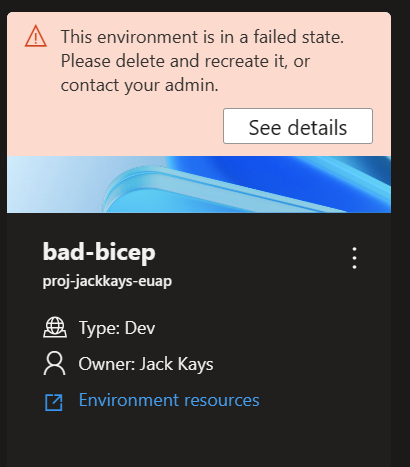
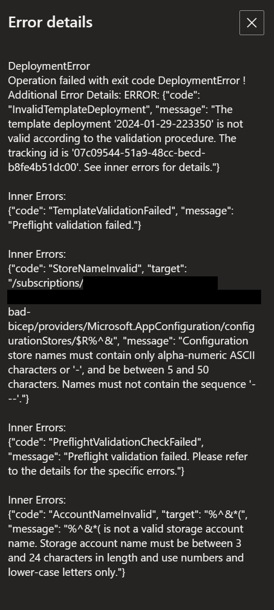

# ADE Custom Image Support - Creating A Docker Image to Provision Using Terraform
This page is designed to help customers understand how to build and utilize custom images within their environment definitions for deployments in Azure Deployment Environments. This document gives an overview on how to configure a custom image to provision infrastructure using the Terraform Infrastructure-as-Code (IaC) framework through Azure Deployment Environments. 

To see how the ADE-authored Core and ARM/Bicep images are structured, check out the Runner-Images folder [here](../../Runner-Images/README.md).

In order to use the ADE CLI, you will need to use an ADE-authored image as a base image. More information about the ADE CLI can be found [here](./ade-cli-docs/README.md).

## Creating and Building A Docker Image Using Terraform

### FROM Statement

If you are wanting to build a Docker image to utilize ADE deployments and access the ADE CLI, you will want to base your image off of one of the ADE-authored images. This can be done by including a FROM statement within a created DockerFile for your new image pointing to an ADE-authored image hosted on Microsoft Artifact Registry.

Here's an example of that FROM statement, pointing to the ADE-authored core image:
```docker
FROM mcr.microsoft.com/deployment-environments/runners/core:latest
```

This statement pulls the most recently-published core image, and makes it a basis for your custom image. Ideally, when building custom images, it's best practice to build off of the ADE-authored core image.

### Installing Terraform Within Your Dockerfile

Using the RUN statement, we can retrieve a stable ZIP file of the Terraform CLI and install the CLI to an executable location for it to be utilized wihtin our deployment and deletion scripts. Here's an example of that process, installing version 1.7.5 of the Terraform CLI:
```docker
RUN wget -O terraform.zip https://releases.hashicorp.com/terraform/1.7.5/terraform_1.7.5_linux_amd64.zip
RUN unzip terraform.zip && rm terraform.zip
RUN mv terraform /usr/bin/terraform
```

You can use the RUN statement to install any additional packages you would need to use within your image. ADE-authored images are based off of the Azure CLI image, and have the ADE CLI and JQ packages pre-installed. You can learn more about the Azure CLI [here](https://learn.microsoft.com/en-us/cli/azure/), and the JQ package [here](https://devdocs.io/jq/).


### Executing Operation Shell Scripts

Within the ADE-authored images, operations are determined and executed based off of the operation name. Currently, the two operation names supported are 'deploy' and 'delete', with plans to expand this moving forward.

To set up your custom image to utilize this structure, specify a folder at the level of your Dockerfile named 'scripts', and specify two files, 'deploy.sh', and 'delete.sh'. The 'deploy' shell script will run when your environment is created or redeployed, and the 'delete' shell script will run when your environment is deleted. You can see examples of this within this repository under the Runner-Images folder for the ARM-Bicep image.

To ensure these shell scripts are executable, add the following lines to your Dockerfile:
```docker
COPY scripts/* /scripts/
RUN find /scripts/ -type f -iname "*.sh" -exec dos2unix '{}' '+'
RUN find /scripts/ -type f -iname "*.sh" -exec chmod +x {} \;
```

### Authoring Operation Shell Scripts to use the Terraform CLI
When deploying infrastructure via Terraform, There are 3 primary steps that need to be taken: 
- ```terraform init'``` - initializes the Terraform CLI to perform actions within the working directory
- ```terraform plan``` - develops a plan based on the incoming Terraform infrastructure files and variables, and any existing state files, and develops steps needed to create or update infrastructure specified in the '.tf' files
- ```terraform apply``` - applies the aforementioned plan to create new or update existing infrastructure in Azure

During the core image's entrypoint, any existing state files will be pulled into the container and the directory will be saved under the environment variable ```$ADE_STORAGE```. Additionally, any parameters set for the current environment will be stored under the variable ```$ADE_OPERATION_PARAMETERS```. In order to access the existing state file, and set your variables within a '.tfvars.json' file, run the following commands:
```bash
EnvironmentState="$ADE_STORAGE/environment.tfstate"
EnvironmentPlan="/environment.tfplan"
EnvironmentVars="/environment.tfvars.json"

echo "$ADE_OPERATION_PARAMETERS" > $EnvironmentVars
```

Additionally, to utilize ADE's privileges to deploy infrastructure inside your subscription, your script will need to use ADE's Managed Service Identity (MSI) when provisioning infrastructure using Terraform's AzureRM provider. If your deployment needs special permissions to complete your deployment, such as particular roles, you will want to assign those permissions to the project environment type's identity that is being used for your environment deployment. ADE will set relevant environment variables, such as the client, tenant, and subscription IDs within the core image's entrypoint, so the following commands will need to be run to ensure the provider uses ADE's MSI:
```bash
export ARM_USE_MSI=true
export ARM_CLIENT_ID=$ADE_CLIENT_ID
export ARM_TENANT_ID=$ADE_TENANT_ID
export ARM_SUBSCRIPTION_ID=$ADE_SUBSCRIPTION_ID
```

If you have any additional variables you would like to reference within your template that are not specified in your environment's parameters, you can set environment variables using the prefix 'TF_VAR'. A list of provided ADE environment variables is provided [here](insert link). An example of those commands could be;
```bash
export TF_VAR_resource_group_name=$ADE_RESOURCE_GROUP_NAME
export TF_VAR_ade_env_name=$ADE_ENVIRONMENT_NAME
export TF_VAR_env_name=$ADE_ENVIRONMENT_NAME
export TF_VAR_ade_subscription=$ADE_SUBSCRIPTION_ID
export TF_VAR_ade_location=$ADE_ENVIRONMENT_LOCATION
export TF_VAR_ade_environment_type=$ADE_ENVIRONMENT_TYPE
```

Now, you can run the primary steps listed above to initialize the Terraform CLI, generate a plan for provisioning infrastructure, and apply a plan during your deployment script:
```bash
terraform init
terraform plan -no-color -compact-warnings -refresh=true -lock=true -state=$EnvironmentState -out=$EnvironmentPlan -var-file="$EnvironmentVars"
terraform apply -no-color -compact-warnings -auto-approve -lock=true -state=$EnvironmentState $EnvironmentPlan
```

During your deletion script, you'd need to run add the 'destroy' flag to your plan generation to delete the existing resources, shown below:
```bash
terraform init
terraform plan -no-color -compact-warnings -destroy -refresh=true -lock=true -state=$EnvironmentState -out=$EnvironmentPlan -var-file="$EnvironmentVars"
terraform apply -no-color -compact-warnings -auto-approve -lock=true -state=$EnvironmentState $EnvironmentPlan
```

Finally, if you want to have the outputs of your deployment uploaded and accessible when accessing your environment via the Azure CLI, you will need to transform the output object from Terraform to the ADE-specified format through the JQ package and set the value to the $ADE_OUTPUTS environment variable, shown below:
```bash
tfOutputs=$(terraform output -state=$EnvironmentState -json)
# Convert Terraform output format to ADE format.
tfOutputs=$(jq 'walk(if type == "object" then 
            if .type == "bool" then .type = "boolean" 
            elif .type == "list" then .type = "array" 
            elif .type == "map" then .type = "object" 
            elif .type == "set" then .type = "array" 
            elif (.type | type) == "array" then 
                if .type[0] == "tuple" then .type = "array" 
                elif .type[0] == "object" then .type = "object" 
                elif .type[0] == "set" then .type = "array" 
                else . 
                end 
            else . 
            end 
        else . 
        end)' <<< "$tfOutputs")

echo "{\"outputs\": $tfOutputs}" > $ADE_OUTPUTS
```

### Building the Image

To build the image to be pushed to your registry, please ensure the Docker Engine is installed on your computer, navigate to the directory of your Dockerfile, and run the following command:
```docker
docker build . -t {YOUR_REGISTRY}.azurecr.io/{YOUR_REPOSITORY}:{YOUR_TAG}
```

For example, if you wanted to save your image under a repository within your registry named 'customImage', and you wanted to upload with the tag version of '1.0.0', you would run:

```docker
docker build . -t {YOUR_REGISTRY}.azurecr.io/customImage:1.0.0
```
## Pushing the Docker Image to a Registry
In order to use custom images, you will need to set up a publicly-accessible image registry with anonymous image pull enabled. This way, Azure Deployment Environments can access your custom image to execute in our container. We are working on providing capaiblities for private registry access, and will provide an update when this is available. 

Azure Container Registry is an offering by Azure that provides storing of container images and similar artifacts.

To create a registry, which can be done through the Azure CLI, the Azure Portal, Powershell commands, and more, please follow one of the quickstarts [here](https://learn.microsoft.com/en-us/azure/container-registry/container-registry-get-started-azure-cli).

To set up your registry to have anonymous image pull enabled, please run the following command in the Azure CLI:
```bash
az login
az acr login -n {YOUR_REGISTRY}
az acr update -n {YOUR_REGISTRY} --public-network-enabled true
az acr update -n {YOUR_REGISTRY} --anonymous-pull-enabled true
```
When you are ready to push your image to your registry, run the following command:
```docker
docker push {YOUR_REGISTRY}.azurecr.io/{YOUR_REPOSITORY}:{YOUR_TAG}
```

## Connecting the Image to your Environment Definition

When authoring environment definitions to use your custom image in their deployment, simply edit the 'runner' property on the manifest file (environment.yaml or manifest.yaml).
```yaml
runner: "{YOUR_REGISTRY}.azurecr.io/{YOUR_REPOSITORY}:{YOUR_TAG}"
```

## Image Building Quickstart Script
If you have a Dockerfile and scripts folder configured for ADE's extensibility model, you can run the script [here](../../Runner-Images/quickstart-image-build.ps1) to build and push to a specified Azure Container Registry (ACR) under the repository 'ade' and the tag 'latest'. This script requires your registry name and directory for your custom image, have the Azure CLI and Docker Desktop installed and in your PATH variables, and requires that you have permissions to push to the specified registry. You can call the script using the following command in Powershell:
```powershell
.\quickstart-image-build.ps1 -Registry '{YOUR_REGISTRY}' -Directory '{DIRECTORY_TO_YOUR_IMAGE}'
```

Additionally, if you would like to push to a specific repository and tag name, you can run:
```powershell
.\quickstart-image.build.ps1 -Registry '{YOUR_REGISTRY}' -Directory '{DIRECTORY_TO_YOUR_IMAGE}' -Repository '{YOUR_REPOSITORY}' -Tag '{YOUR_TAG}'
```

## Terraform + ADE Extensibility Model Repository
If you have set up an Azure Container Registry to contain images for your extensibility model workflow and are looking to use Terraform Infrastructure-as-Code (IaC) templates, we have set up a sample repository [here](https://github.com/Azure/ade-extensibility-model-terraform) containing an ADE-compatible image and a GitHub Action that builds and pushes the image to your Azure Container Registry. In order to use this method, you will need to do the following:
 - Fork the repository into your personal account
 - Allow GitHub Actions to connect to Azure via an Microsoft Entra ID application's federated credentials through OIDC. You will need to save the application's client ID as a secret within your forked repository, along with your subscription and Tenant ID. You can find more documentation about the process [here](https://learn.microsoft.com/en-us/azure/developer/github/connect-from-azure?tabs=azure-cli%2Clinux).
 - Set up variables for your forked repository containing your personal Azure Container Registry name, your preferred repository name, and your preferred tag for the created image. You can modify your variables between workflow runs to push the generated image to different registries, repositories, and tags.
  
This repository is meant as a sample to give customers a starting point to deploy their environments with Terraform, allow customers to add additional customizations while using ADE's extensibility model, and easily upload their changes to their connected Azure Container Registry.

## Accessing Operation Logs And Error Details
To view error details with deployments and deletions, you can use the [Developer Portal](https://devportal.microsoft.com/) to view the error details stored in the file $ADE_ERROR_LOG at the end of the deployment by clicking on the 'See Details' button of a failed deployment, shown below:



Additionally, you can use the Azure CLI to view an environment's error details using the following command:
```bash
az devcenter dev environment show --environment-name {YOUR_ENVIRONMENT_NAME} --project {YOUR_PROJECT_NAME}
```

To view the operation logs for an environment deployment or deletion you can use the Azure CLI to retrieve the latest operation for your environment, and then view the logs for that operation ID, shown below:
```bash
# Get list of operations on the environment, choose the latest operation
az devcenter dev environment list-operation --environment-name {YOUR_ENVIRONMENT_NAME} --project {YOUR_PROJECT_NAME}
# Using the latest operation ID, view the operation logs
az devcenter dev environment show-logs-by-operation --environment-name {YOUR_ENVIRONMENT_NAME} --project {YOUR_PROJECT_NAME} --operation-id {LATEST_OPERATION_ID}
```

# Getting help or providing feedback

If you are facing any issues, please create a new issue in [GitHub Issues](https://github.com/Azure/deployment-environments/issues). 

If you have general feedback about the product, please submit the feedback on the [Developer Community](https://developercommunity.visualstudio.com/deploymentenvironments) or by [emailing us directly](mailto:adesupport@microsoft.com).
