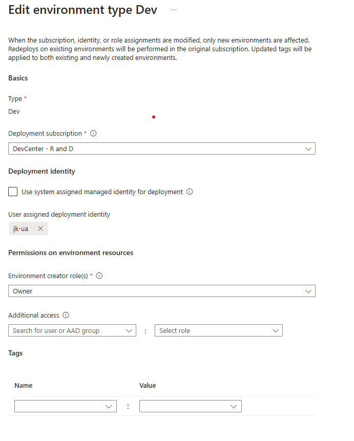
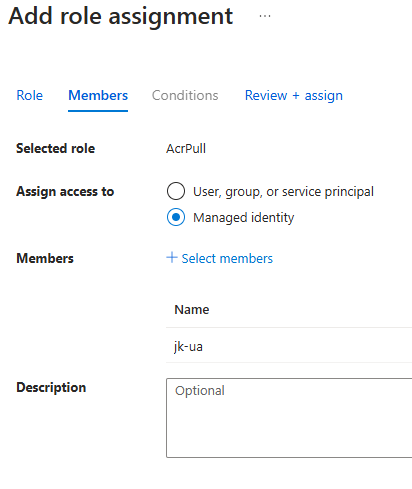

# ADE Extensibility Model Private Registry Support
This page is designed to help customers who have onboarded to the Private Registry Private Preview when using Azure Deployment Environments' extensibility model feature, allowing a customer's privately hosted images within an Azure Container Registry to be utilize to deploy infrastructure. At this time, the feature only supports private Azure Container Registry images.

> Note - If you are interested in learning more about private preview capabilities or would like to sign-up to gain early-access to new capabilities, please [email us](mailto:adesupport@microsoft.com) 

In order to successfully use the feature, ensure your subscription is onboarded to the preview within the region of your desired project. Next, you'll need to set your project environment type's identity to user-assigned, as opposed to using a system-assigned managed identity for deployment. To configure this, navigate to the 'Environment Types' blade of your selected project, and select an existing environment type to edit or add a new project environment type. Under the 'Deployment Identity' section, uncheck the default option for 'Use system assigned managed identity for deployment' and click the 'Add User assigned deployment identity option' to select a given user-assigned Managed Identity.



Next, navigate to your private Azure Container Registry resource, and select the 'Access Control (IAM)' blade on the right-hand side, and add a role assignment. In order to access your private registry, the user-assigned identity just added to your project environment type will need to have the 'AcrPull' role assigned. Select the role 'AcrPull', toggle the 'Assign access to' option to 'Managed Identity', and select the previously assigned User-Assigned identity to grant the role to.



With these changes, your project environment type will now be configured to execute deployments based off of the images stored in your private container registry. Simply reference the image link in your environment definition manifest file, and your deployments and deletions will be executed with your custom private image. Here's an example below:

```yaml
runner: "{YOUR_REGISTRY}.azurecr.io/{YOUR_REPOSITORY}:{YOUR_TAG}"
```

# Getting help or providing feedback

If you are facing any issues, please create a new issue in [GitHub Issues](https://github.com/Azure/deployment-environments/issues). 

If you have general feedback about the product, please submit the feedback on the [Developer Community](https://developercommunity.visualstudio.com/deploymentenvironments) or by [emailing us directly](mailto:adesupport@microsoft.com).
